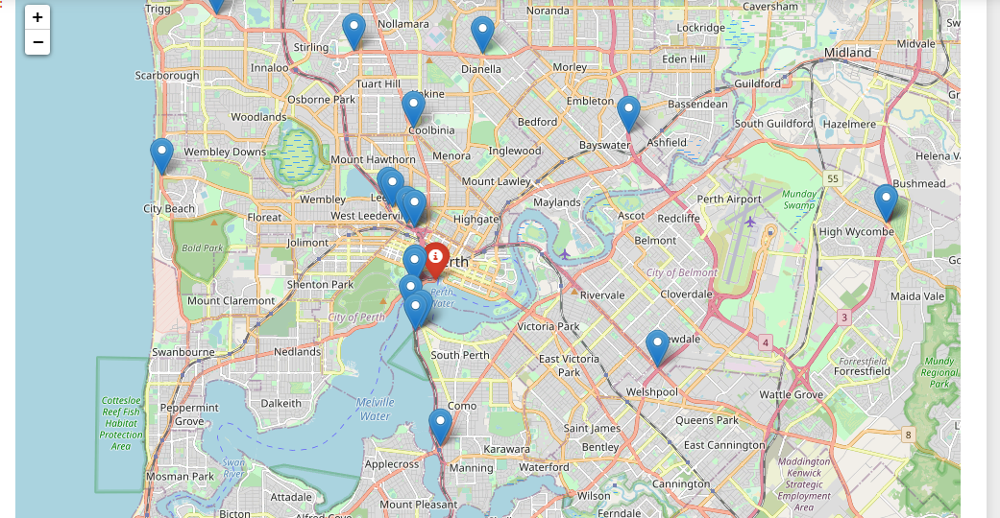

# etl_project

## ETL PROJECT / Team project

* SUBJECT – PERTH METROPOLITAN AREA ROADWORKS 
* TEAM QUOKKA – TONY ZHAO/MARA VENABLES

## OVERVIEW 

This ETL project aims to provide relevant data for all the roadworks current undertaken by Mainroads across Perth Metropolitan Area, within the scope requested by our ‘client’, whose main proposal aims to assess the disruption of the roadworks on the commercial activities and community events in each suburb.

**Roadwork Map:**

## Project SCOPE

Extract the following from mrwa-roadworks dataset:

## Clean Data tables/Collections	 Columns/ Fields	Raw data sources

### Table 1 – roadworks_ projects	Id int PRIMARY KEY,
* StartDate Date,
* FinishDate 

 Region 	https://catalogue.data.wa.gov.au/dataset/mrwa-roadworks

### Table 2 – roadworks_details	Id int PRIMARY KEY,
* StartDate 
* FinishDate 

 TrafficImpact 	https://www.mainroads.wa.gov.au/projects-initiatives/projects/metropolitan/

